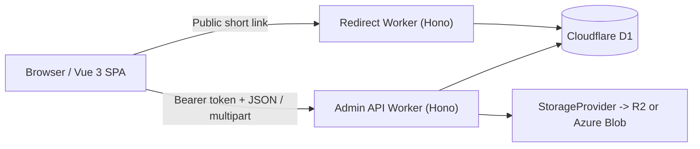

English | [繁體中文](ARCHITECTURE.zh-TW.md)

# AkaMoney Architecture

## System Overview

AkaMoney is a three-application system deployed on Cloudflare:

1. A Vue 3 management SPA in `src/frontend`
2. A Hono-based Admin API Worker in `src/backend`
3. A public Hono Redirect Worker in `src/redirect`

Both Workers use the same D1 database schema. Object storage is abstracted behind a provider interface so the Admin API can write to Cloudflare R2 by default or Azure Blob Storage when configured.

## Runtime Components

### Frontend Management SPA

The frontend is a single-page application built with:

- Vue 3 Composition API
- Pinia for application state
- Vue Router for protected navigation
- Tailwind CSS v4 through CSS-first configuration in `src/frontend/src/assets/css/main.css`
- Chart.js for analytics and account-level charts

The SPA is authenticated, but it also contains a development-only `VITE_SKIP_AUTH` mode that swaps real API access for in-memory mocks.

### Admin API Worker

The Admin API is a Hono application that provides:

- URL creation, listing, updates, and deletion
- Protected analytics and overall statistics
- Public limited analytics
- Manual cleanup of old click records
- Storage configuration, upload, listing, metadata lookup, and deletion
- A scheduled daily cleanup job

The Worker composes global CORS and error middleware, then protects management routes with Entra-token validation.

### Redirect Worker

The Redirect Worker is intentionally public and minimal:

- resolves only active short codes from D1
- performs a case-insensitive lookup
- rejects expired links in the route handler with `410 Gone`
- redirects valid requests with `302`
- uses `waitUntil(...)` to record click metadata and increment the denormalized click counter asynchronously

### Shared Data and Contracts

The system shares data through D1, not through a shared runtime package:

- `src/backend/src/types/index.ts` defines backend request and response types
- `src/frontend/src/types/index.ts` defines duplicated frontend contract types
- `src/shared/types/index.ts` exists, but the live frontend and backend do not import it as a package

That means contract changes currently have to be updated in multiple places.

## Request Flows

### Management Request Flow

1. The SPA initializes authentication state through the Pinia auth store.
2. MSAL acquires an Entra access token.
3. Axios attaches the bearer token to Admin API requests.
4. The Admin Worker verifies issuer, audience, and signing keys against Entra JWKS.
5. Route handlers call service-layer functions that read or write D1 and, for image uploads, the selected storage provider.

### Public Redirect Flow

1. A client requests `GET /:shortCode` from the Redirect Worker.
2. The Worker loads the active short-code record from D1 with a case-insensitive match.
3. The route handler rejects expired links with `410 Gone`.
4. Valid links return `302` immediately.
5. Click recording runs in the background via `executionCtx.waitUntil(...)`.

### Storage Upload Flow

1. An authenticated browser submits `multipart/form-data` to the Admin Worker.
2. The Worker validates MIME type, file size, and provider configuration.
3. The storage factory resolves `r2` or `azure`.
4. The provider stores the object under `uploads/<user-id>/...`.
5. The returned public URL, when available, is later stored on URL records as `image_url`.

## Data Ownership and Persistence

### D1 as the Shared System of Record

Both Workers point at the same D1 database binding named `DB`:

- the Admin Worker owns link-management writes, user upserts, analytics queries, storage-related metadata reads, and scheduled retention cleanup
- the Redirect Worker reads `urls`, inserts `click_records`, and increments `urls.click_count`

All persisted timestamps use epoch milliseconds.

### User Ownership Boundaries

- Management queries are scoped to the authenticated Entra user ID stored in `urls.user_id`.
- File APIs are scoped by key prefix: `uploads/<user-id>/...`.
- Public redirect and public analytics endpoints never require authentication.

## Authentication and Trust Boundaries

### Browser to Admin Worker

The Admin Worker trusts only Entra-issued access tokens that pass:

- JWKS signature verification
- issuer validation for both Microsoft Entra v1 and v2 issuer formats
- audience validation for both `<client-id>` and `api://<client-id>`

### Browser to Redirect Worker

The Redirect Worker is deliberately unauthenticated. Its trust boundary is narrower:

- it may read only what is needed to resolve a redirect
- it records click telemetry asynchronously
- it does not expose management APIs

### Storage Boundary

Only the Admin Worker talks to object storage. Storage configuration is resolved at runtime through the `StorageProvider` abstraction, with `CDN_URL` taking precedence over provider-specific public URLs.

## Known Architectural Constraints

### Duplicated Contract Types

The repository contains a `src/shared/types` directory, but the active frontend and backend code paths do not import it. In practice:

- contracts are duplicated between `src/frontend/src/types/index.ts` and `src/backend/src/types/index.ts`
- frontend mocks in `src/frontend/src/services/api.ts` also need manual updates when response shapes change

### Mixed Error Translation

The Admin API has shared error middleware, but several route handlers catch service exceptions and currently repackage them as generic `500` responses. The documented API reference reflects current behavior, not ideal future behavior.

## Related Documents

- [README](../README.md)
- [API Reference](API.md)
- [Authentication](AUTHENTICATION.md)
- [Database](DATABASE.md)
- [Storage](STORAGE.md)
- [Project Structure](PROJECT_STRUCTURE.md)
