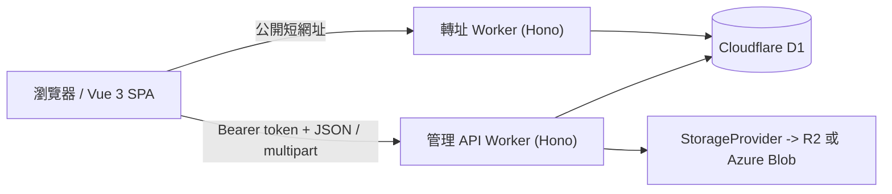

[English](ARCHITECTURE.md) | 繁體中文

# AkaMoney 架構

## 系統總覽

AkaMoney 是一個部署在 Cloudflare 上的三應用系統：

1. `src/frontend` 中的 Vue 3 管理 SPA
2. `src/backend` 中以 Hono 建成的管理 API Worker
3. `src/redirect` 中公開對外的 Hono 轉址 Worker

兩個 Worker 共用同一套 D1 資料庫結構。物件儲存則透過 provider 介面抽象化，因此管理 API 預設可寫入 Cloudflare R2，也能在設定後改用 Azure Blob Storage。

## 執行元件

### 前端管理 SPA

前端是單頁應用，技術組成如下：

- Vue 3 Composition API
- Pinia 狀態管理
- Vue Router 保護式導覽
- 透過 `src/frontend/src/assets/css/main.css` 採用 CSS-first 設定的 Tailwind CSS v4
- 以 Chart.js 呈現分析與帳戶層級圖表

這個 SPA 需要驗證，但也內建僅限開發環境的 `VITE_SKIP_AUTH` 模式，會把真實 API 存取改成記憶體 mock。

### 管理 API Worker

管理 API 是一個 Hono 應用，提供：

- 短網址建立、列表、更新與刪除
- 受保護的 analytics 與 overall stats
- 公開但受限欄位的 analytics
- 舊點擊紀錄的手動清理
- 儲存設定、上傳、列表、metadata 查詢與刪除
- 每日排程的清理工作

這個 Worker 先組合全域 CORS 與錯誤中介層，再以 Entra token 驗證保護管理路由。

### 轉址 Worker

轉址 Worker 刻意保持公開且精簡：

- 只從 D1 解析啟用中的短碼
- 以不分大小寫方式查詢
- 在路由處理器中以 `410 Gone` 拒絕過期連結
- 對有效請求回傳 `302`
- 以 `waitUntil(...)` 非同步記錄點擊 metadata 並增加反正規化 click counter

### 共用資料與合約

系統是透過 D1 共用資料，而不是透過共用 runtime package：

- `src/backend/src/types/index.ts` 定義後端 request / response 型別
- `src/frontend/src/types/index.ts` 定義前端重複的一份合約型別
- `src/shared/types/index.ts` 雖然存在，但目前執行中的前後端並沒有把它當成 package 匯入

這表示合約變更目前需要同步修改多個地方。

## 請求流程

### 管理請求流程

1. SPA 透過 Pinia auth store 初始化驗證狀態。
2. MSAL 取得 Entra access token。
3. Axios 把 bearer token 加到管理 API 請求。
4. 管理 Worker 透過 Entra JWKS 驗證 issuer、audience 與簽章。
5. 路由處理器呼叫 service 層，對 D1 進行讀寫；若是圖片上傳，也會呼叫選定的 storage provider。

### 公開轉址流程

1. 用戶端向轉址 Worker 發出 `GET /:shortCode`。
2. Worker 以不分大小寫方式從 D1 載入啟用中的短碼紀錄。
3. 路由處理器會以 `410 Gone` 拒絕已過期連結。
4. 有效連結會立即回傳 `302`。
5. 點擊紀錄透過 `executionCtx.waitUntil(...)` 在背景寫入。

### 儲存上傳流程

1. 已驗證的瀏覽器以 `multipart/form-data` 向管理 Worker 送出請求。
2. Worker 驗證 MIME type、檔案大小與 provider 設定。
3. Storage factory 解析出 `r2` 或 `azure`。
4. Provider 把物件寫到 `uploads/<user-id>/...`。
5. 若 provider 能提供公開 URL，稍後會把該值存入短網址記錄的 `image_url`。

## 資料擁有權與持久化

### D1 作為共用 System of Record

兩個 Worker 都指向同一個名為 `DB` 的 D1 綁定：

- 管理 Worker 擁有連結管理寫入、使用者 upsert、analytics 查詢、儲存相關 metadata 讀取與排程保留清理
- 轉址 Worker 會讀取 `urls`、插入 `click_records`，並增加 `urls.click_count`

所有持久化時間戳都使用 epoch 毫秒。

### 使用者擁有權邊界

- 管理查詢會以 `urls.user_id` 對應的 Entra 使用者 ID 範圍過濾。
- 檔案 API 以 key 前綴 `uploads/<user-id>/...` 進行隔離。
- 公開轉址與公開 analytics 路由都不需要驗證。

## 驗證與信任邊界

### 瀏覽器到管理 Worker

管理 Worker 只信任通過以下條件的 Entra access token：

- JWKS 簽章驗證
- 同時接受 Microsoft Entra v1 與 v2 issuer 格式
- 同時接受 `<client-id>` 與 `api://<client-id>` audience

### 瀏覽器到轉址 Worker

轉址 Worker 刻意不做驗證，因此它的信任邊界更窄：

- 只能讀取完成轉址所需的最小資料
- 只會非同步記錄點擊遙測
- 不暴露管理 API

### 儲存邊界

只有管理 Worker 會直接操作物件儲存。儲存設定會在執行時透過 `StorageProvider` 抽象解析，且 `CDN_URL` 會優先於 provider 專屬公開 URL。

## 已知架構限制

### 重複的合約型別

儲存庫內雖然有 `src/shared/types` 目錄，但目前執行中的前後端程式碼路徑都沒有實際匯入它。實際上：

- 合約重複存在於 `src/frontend/src/types/index.ts` 與 `src/backend/src/types/index.ts`
- `src/frontend/src/services/api.ts` 內的前端 mock 回應在 response shape 變更時也要手動更新

### 混合式錯誤轉譯

管理 API 有共用 error middleware，但多個路由處理器會先 catch service 例外，並把它們重新包裝成通用 `500`。API 參考文件記錄的是「目前真實行為」，不是理想中的未來狀態。

## 相關文件

- [專案 README](../README.zh-TW.md)
- [API 參考](API.zh-TW.md)
- [驗證](AUTHENTICATION.zh-TW.md)
- [資料庫](DATABASE.zh-TW.md)
- [儲存](STORAGE.zh-TW.md)
- [專案結構](PROJECT_STRUCTURE.zh-TW.md)
