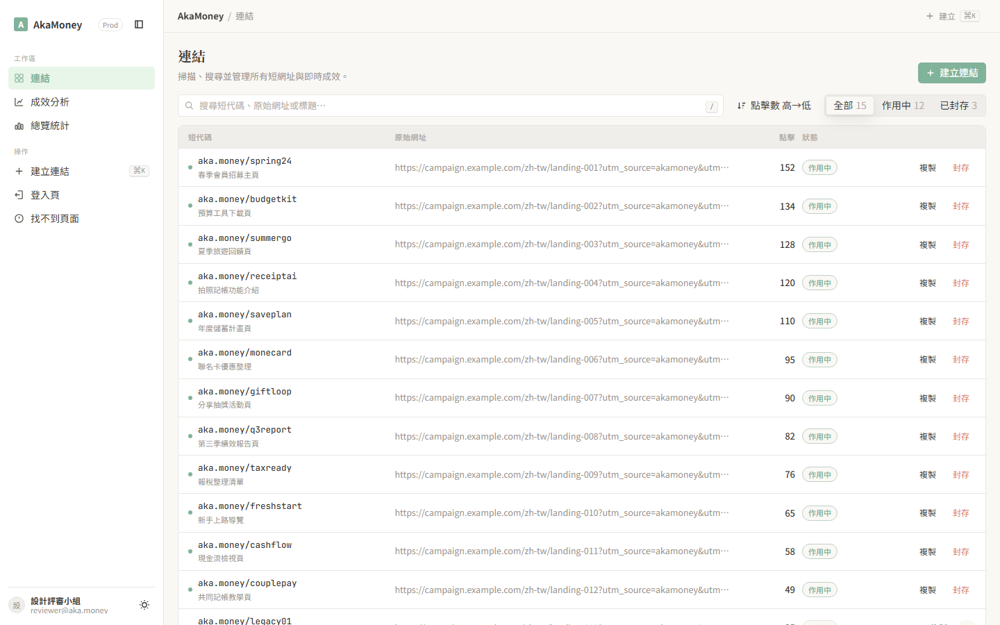
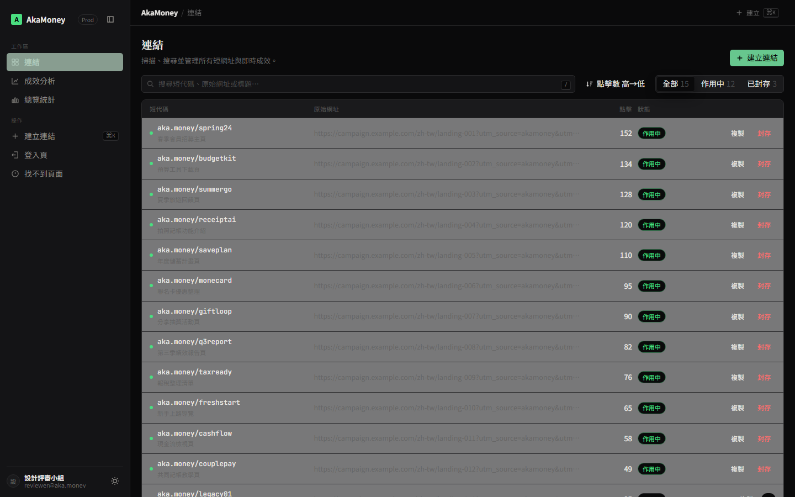
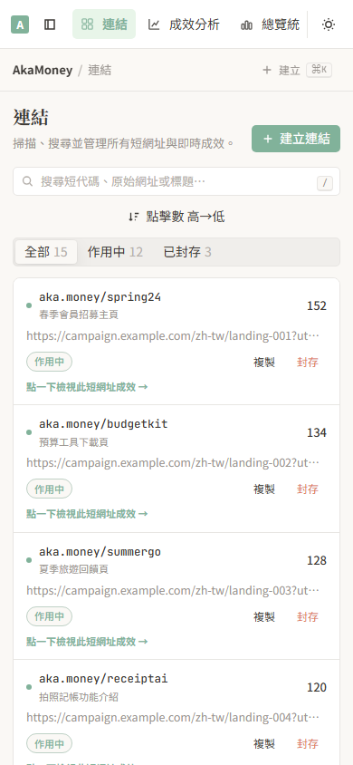
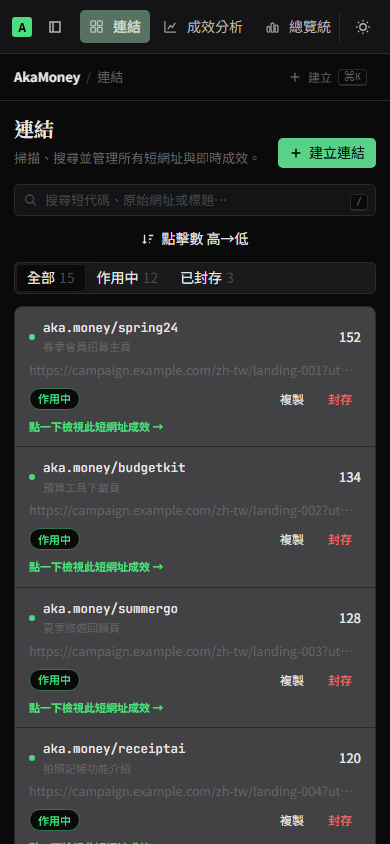

English | [繁體中文](SCREENSHOTS.zh-TW.md)

# Screenshots and visual reference

This page describes the **shipped** management-dashboard routes and states, then points at committed **design mockups**. Those images are not proof of the current Vue runtime.

## What these images are

| Kind | In this repo? | Treat as |
|------|---------------|----------|
| `design-mockups/screenshots/m2-mone-dense-*.png` | Yes | Design mockup / reference only |
| Other `design-mockups/screenshots/*.png` | Yes | Historical bakeoff captures, not the shipped UI |
| `docs/screenshots/*` or Playwright traces of the Vue app | **No** | Do not invent or link them |

Session-local captures (for example files kept only under a Copilot session folder) are not part of the repository and must not be linked.

## Visual system identifier

The shipped visual system is **`m2-mone-dense`** (Proposal F / Monē dense data tool). Mapping evidence:

- `src/frontend/src/assets/css/main.css` header: “Proposal F (Mone 高密度資料工具變體)” and tokens that match `design-mockups/proposals/m2-mone-dense.manifest.json`
- `useChartTheme.ts` cites that same manifest for `CHART_SERIES`
- `DashboardView.vue` and `UrlTable.vue` comments: Proposal F vertical slice — KPI → inline quick-create → dense table
- Manifest DNA: `collapsible-sidebar`, `dense-table`, `inline-quick-create` — implemented by `AppShell` / `UrlTable` / `QuickCreatePanel`

See [THEME](THEME.md) for tokens. See [PROJECT_STRUCTURE](PROJECT_STRUCTURE.md) for where mockups vs runtime live.

## Shipped routes and views

Source: `src/frontend/src/router/index.ts` and the views it loads. Login is standalone; every authenticated route uses `AppShell`.

| Route | View | Auth | Topbar title |
|-------|------|------|--------------|
| `/` | redirect → `/dashboard` | — | — |
| `/login` | `LoginView` | public | 登入 |
| `/dashboard` | `DashboardView` | required | 連結 |
| `/stats` | `OverallStatsView` | required | 總覽統計 |
| `/analytics/:shortCode` | `AnalyticsView` | required | 成效分析 |
| `/:pathMatch(.*)*` | `NotFoundView` | required | 找不到頁面 |

Sidebar nav (shipped) is only **連結** and **總覽統計**. Per-link analytics is opened from a table row, not from a third sidebar item.

### Login (`/login`)

Centered card: brand mark, “登入 AkaMoney”, Microsoft Entra ID button. States in the view: loading (“正在前往登入…”), configuration/login error, and a warning notice when `VITE_SKIP_AUTH` skip-auth mode is on.

### Dashboard (`/dashboard`)

Composition (not a single modal-first page):

1. `KpiSummary` — independent 30-day overall-stats fetch (clicks, active, total, average). Own loading / error + retry.
2. `QuickCreatePanel` — inline create (`original_url`, required alias, optional title / description / preview image).
3. `UrlTableToolbar` — search, click-count sort, status tabs. **Current server page only** (`page` / `limit`).
4. List states: loading (`StateBlock`), list error, empty (“尚未建立任何短網址”), no-results for the current page, or `UrlTable`.
5. Table columns: short link (display host `aka.money`), original URL, clicks, status (`作用中` / `已封存` / `已過期`), actions (copy, analytics, edit, archive or restore).
6. `DashboardPagination`, `UrlEditModal`, archive/restore `ConfirmActionModal`, `DashboardToastStack`.

There is no delete-forever UI in this view. Archive stops redirects; restore brings them back.

### Overall stats (`/stats`)

Account-level range form (start/end + 本月). States: first-load loading, error (or “無法更新” when stale data remains), KPI row, Chart.js line (click trend) + two doughnuts (country, device), top-links list or its empty line.

### Per-link analytics (`/analytics/:shortCode`)

States: loading, not-found, error, or the subject header + range chips (`近 7 日` / `近 30 日` / `近 30 日（API）`). Charts: daily line, country doughnut, device doughnut, browser bar. Recent-clicks table (up to 10) or empty. The API’s daily series is a 30-day window; “all” is that same window, not lifetime history.

### Not found

Authenticated 404: large 404 wordmark, short explanation, link back to `/dashboard`.

## Light, dark, and responsive layout

- Theme toggle is the sun/moon control in the sidebar. `data-theme` + `akamoney-theme` — [THEME](THEME.md).
- Desktop: sticky sidebar (`236px`, collapsible to `64px`) + topbar crumbs + user menu / logout.
- `max-width: 860px`: hamburger opens an off-canvas drawer + scrim; KPI grid becomes 2 columns; charts stack; table header hides and rows use stacked areas.

Do not infer extra keyboard shortcuts, WCAG claims, or browser support from the mockups. Those are not documented as shipped capabilities here.

## Design mockup captures

The following files exist and are **design mockups / references**, not current runtime proof. They show the `m2-mone-dense` HTML proposal’s **連結** screen (dense table, chip-style filters, mock “建立連結” button). They differ from the shipped app in several visible ways: extra sidebar items (成效分析 / 建立連結 / 登入頁 / 找不到頁面), no inline `QuickCreatePanel`, mobile chip nav instead of the 860px drawer, and `/` · `⌘K` decorations that the Vue app does not ship.

**Desktop light — design mockup / reference**

**Desktop dark — design mockup / reference**

**Mobile light — design mockup / reference**

**Mobile dark — design mockup / reference**

Interactive proposal HTML: [`design-mockups/proposals/m2-mone-dense.html`](../design-mockups/proposals/m2-mone-dense.html). Other prefixes under `design-mockups/screenshots/` (`01-linear` … `12-playful`, `m1-mone-faithful`) are earlier bakeoff directions, not the shipped system.

## Validation artifacts

Committed Playwright under `design-mockups/validation/` (`playwright.config.mjs`, `proposals.spec.mjs`, `task-3-validation-report.md`) validates **proposal HTML**, not the Vue SPA. There is no committed e2e folder or runtime screenshot set for the dashboard. Use local `npm run test` / a running app if you need to confirm behaviour.

## Related documents

- [README](../README.md)
- [Theme](THEME.md)
- [Project structure](PROJECT_STRUCTURE.md)
- [Setup](SETUP.md)
- [API](API.md)
